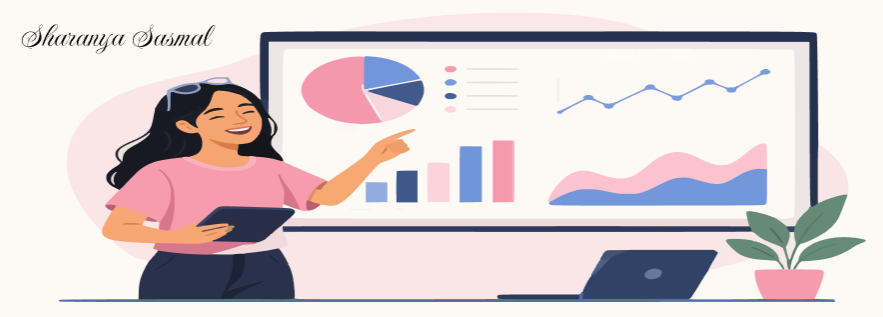

 

# 👋 Hi, I'm Sharanya Sasmal

### Electronics & Computer Engineering Student @ VIT Chennai

**Frontend Development • UI/UX Design • Web Development • Emerging Technologies**

 

  

---

## 🌷 About Me

I'm a **B.Tech student in Electronics and Computer Engineering at Vellore Institute of Technology, Chennai**, interested in creating digital experiences that are both **visually clean and easy to use**.

My primary interests are **frontend development, UI/UX design, and web technologies**. I enjoy taking an idea or design and turning it into a functional, responsive interface while paying attention to usability and visual details.

I'm currently strengthening my development and design skills through **hands-on projects, academic work, and continuous experimentation with new technologies**. I'm especially interested in projects that bring together **technology, creativity, and real-world problem solving**.

> ✨ *Design with purpose. Build with curiosity. Keep learning.*

---

## 💻 What I'm Working On

- 🎨 Designing clean and intuitive **UI/UX experiences**
- 🌐 Building responsive and user-focused **web interfaces**
- 🔧 Exploring the connection between **electronics and web-based applications**
- 📚 Improving my **problem-solving and development workflow**
- 🚀 Turning ideas into practical projects and continuously learning from them

---

## 🛠️ Tech Stack

### Web & Design

  
  
  
  

### Programming & Databases

  
  
  
  
  

### Tools & Platforms

  
  
  
  

---

## 📌 Featured Interests

<table>
<tr>
<td width="50%" valign="top">

### 🎨 UI/UX Design
Creating interfaces with a focus on:
- Visual hierarchy
- Usability
- Responsive layouts
- Consistent design systems
- Design-to-code workflows

</td>
<td width="50%" valign="top">

### 🌐 Web Development
Interested in:
- Responsive websites
- Interactive interfaces
- Clean frontend architecture
- User-centered experiences
- Practical web-based solutions

</td>
</tr>
</table>

---

## 📊 GitHub Activity

  

---

## 🏆 GitHub Achievements

---

## 🤝 Let's Connect

I'm always open to **learning, collaborating, building projects, and connecting with people interested in technology and design**.

  

⭐ **Thanks for visiting my profile!**

