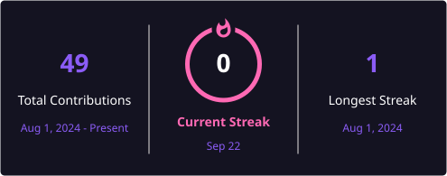

  

# 👋 Hi there! I'm Sharanya

### A frontend developer who loves turning clean UI/UX designs into seamless digital experiences. ✨

 

🎓 **Second-year Electronics and Computer Engineering student at Vellore Institute of Technology, Chennai.**

💡 **Passionate about UI/UX design, web development, and creating user-centric solutions.**

🎯 **Exploring the intersection of electronics and web technologies.**

🌱 **Always learning, building, and looking for opportunities to grow.**

---

<table>
<tr>

<td width="68%" valign="top">

# 🛠️ Tech Stack

### 🌐 Web & Design

### 💻 Programming & Databases

### 🔧 Tools & Platforms

</td>

<td width="32%" valign="top">

  

> ## 💗
>
> **Good design turns ideas into opportunities.**

 

🌸 **Design**

💻 **Code**

🎨 **Create**

📚 **Learn**

🚀 **Grow**

</td>

</tr>
</table>

---

# 📊 GitHub Stats

&nbsp;&nbsp;

  

---

# 📈 Contribution Graph

  

---

# 🌱 My GitHub Journey

<table>
<tr>

<td align="center" width="25%">

## 💡

### LEARN

Explore new ideas

</td>

<td align="center" width="25%">

## 🎨

### DESIGN

Create experiences

</td>

<td align="center" width="25%">

## 🚀

### BUILD

Turn ideas into projects

</td>

<td align="center" width="25%">

## ✨

### GROW

Keep improving

</td>

</tr>
</table>

---

# 🚀 What I'm Exploring

<table>
<tr>

<td width="50%" valign="top">

### 🎨 UI/UX Design

✨ Clean interfaces  
✨ Responsive layouts  
✨ Wireframing  
✨ Prototyping  
✨ Design systems  

</td>

<td width="50%" valign="top">

### 🌐 Web Development

💻 Responsive websites  
💻 Interactive interfaces  
💻 User-centered experiences  
💻 Frontend development  
💻 Design-to-code  

</td>

</tr>
</table>

---

# 🎯 Currently

| 🌷 Area | 🚀 Status |
|:---|:---|
| 🎨 UI/UX Design | 🌱 Learning & Creating |
| 🌐 Web Development | 🚀 Building Projects |
| 💻 Programming | 📚 Strengthening Skills |
| 🔬 Emerging Technologies | 🔍 Exploring |

---

# 🤝 Let's Connect

Feel free to reach out for collaborations, opportunities,
or just a chat about tech and design! 💗

 

  

### 💖 Thanks for stopping by!

**✨ Keep learning • Keep creating • Keep building ✨**

